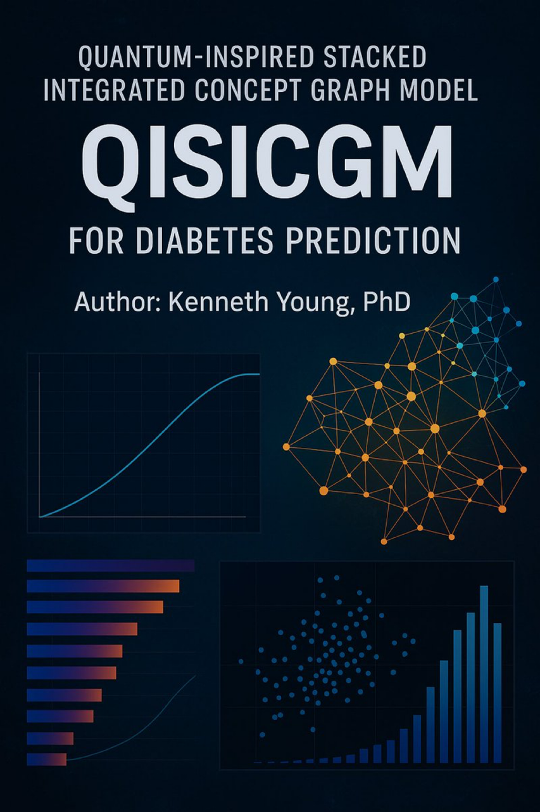
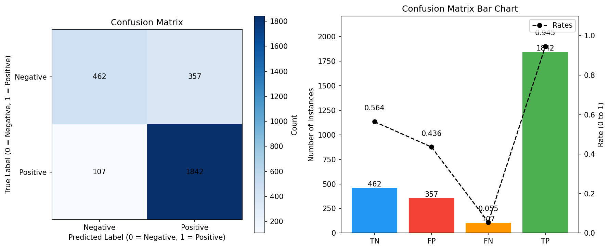
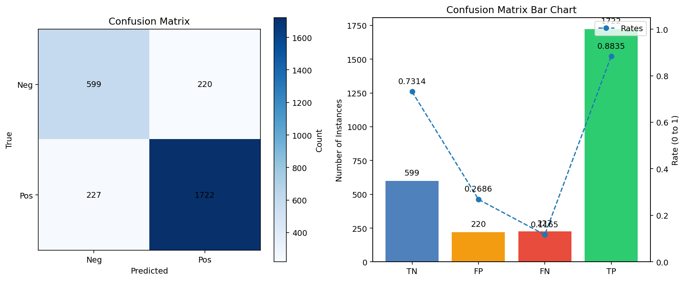
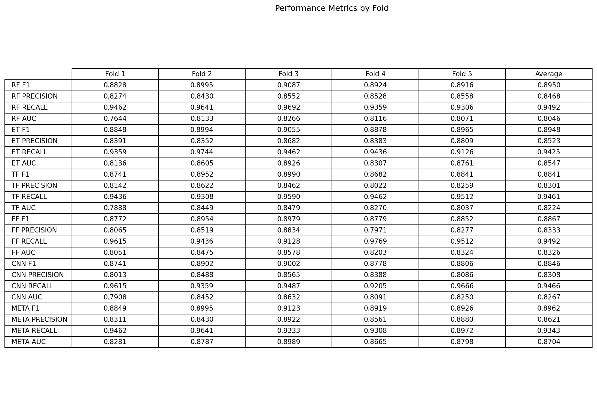
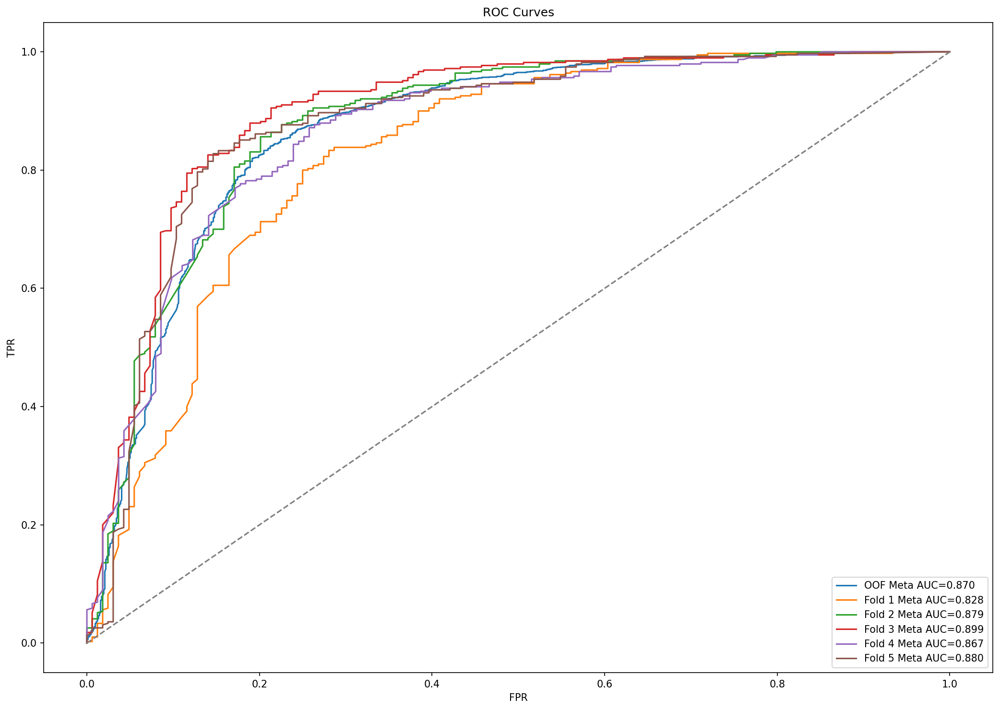
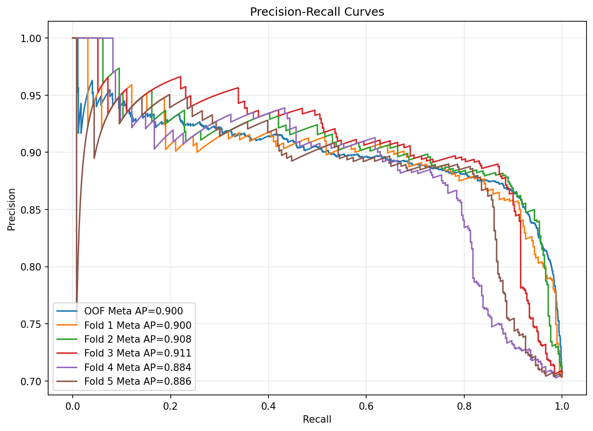
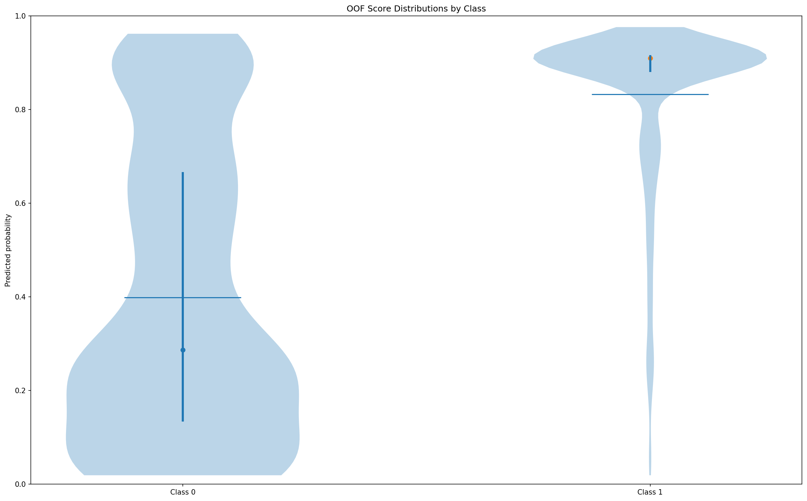
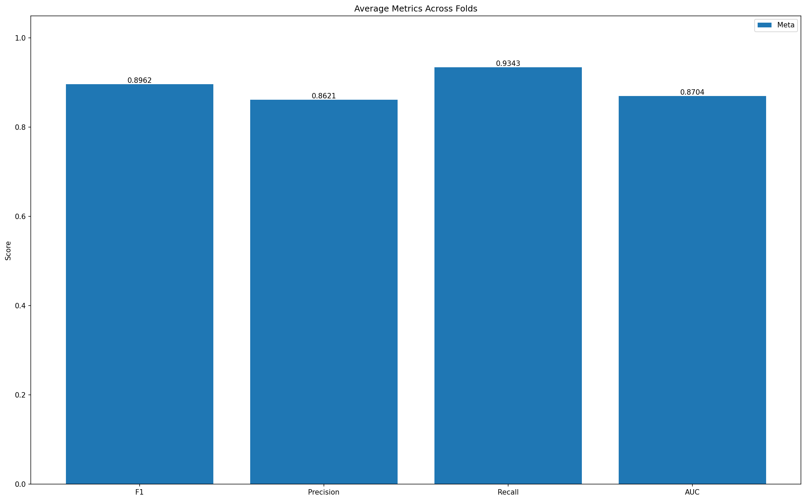
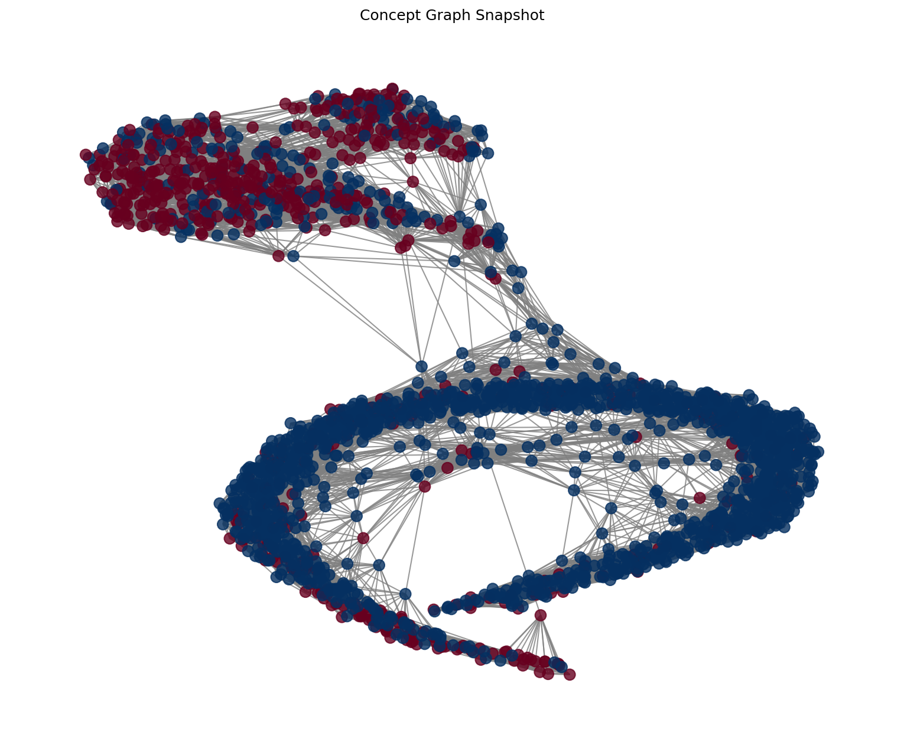

# Quantum-Inspired Stacked Integrated Concept Graph Model (QISICGM) for Diabetes Prediction
Author: Kenneth Young, PhD

## Overview
**QISICGM** is a quantum-inspired stacked ensemble that learns an embedding space and an explicit **concept graph** from tabular health data, then trains diverse base learners and a meta-learner to predict diabetes risk. It emphasizes **calibration, recall, and interpretable visuals**, while remaining **CPU-friendly** and fast at inference.

- **Dataset**: PIMA Indians Diabetes (768 rows, 8 base features) + **2,000 synthetic rows** → total **2,768** with **1,949 positives**.
- **Latest OOF Meta**: **F1 = 0.8933**, **AUC = 0.8699** at default threshold **0.3760** (balanced alternative: **0.6503**, F1 **0.8851**).
- **Per-fold meta means**: F1 **0.8962**, AUC **0.8704**.
- **Inference speed (demo)**: Scored **15 patients in ~1.76s** (~8.5 rows/s) with risk bands (`very-low` → `very-high`).

Training lives in **`qisicgm_stacked.py`**, inference demo in **`make_demo_predictions.py`**, and all visuals in **`plots_and_reporting.py`**.

 

For methodology and results, see: [Quantum-Inspired Stacked Integrated Concept Graph Model (QISICGM) for Diabetes Risk Prediction](paper/qisicgm_paper.pdf)
   
## Why This Matters
Medical screening often requires **high recall** without throwing precision out the window. QISICGM’s hybrid stack (trees + transformer + CNN + FFNN) learns complementary views over a shared embedding, while the **concept graph** preserves neighborhood structure across training and inference. The result: a **robust, practical, GPU/CPU-friendly** predictor, useful for **AI-assisted clinical triage** and other structured-data problems beyond diabetes.

## What’s New
- **Faster Concept Graph Snapshot**: Restored **spring-layout** snapshot (`plot_graph_snapshot`) to avoid slow manifold projections; one PNG per fold (`plots/concept_graph_fold{K}.png`).
- **Unified Plotting Module**: All figures centralized in `plots_and_reporting.py` (confusion + bars, reliability & hist, ROC/PR, score violins, performance table, summary bars, concept graph).
- **Headless-Safe Matplotlib**: Auto-switches to `Agg` backend if no display is present.
- **Reproducibility**: Default **seed=42** across NumPy, scikit-learn, and PyTorch; stratified snapshot sampling uses `np.random.default_rng(42)`.
- **Threshold Guard Option**: Alongside OOF-F1 optimal threshold, a **“balanced”** threshold caps relative F1 drop to ≤1% while boosting specificity.
- **Cleaner Artifacts**: Saves trained models, scaler, embeddings bank, per-model final calibrators, and config in `models/` for portable inference.

---

## Repository Structure
```
QISICGM/
├─ data/
│  ├─ pima-indians-diabetes.csv
│  └─ synthetic_pima_data.csv           # optional (auto-used if present)
├─ models/                              # created by training
├─ plots/                               # created by training
├─ qisicgm_stacked.py                   # training + OOF evaluation
├─ make_demo_predictions.py             # fast inference on new patients
├─ plots_and_reporting.py               # all plotting utilities
├─ requirements.txt
└─ README.md
```

---

## Requirements
- Python 3.9+
- numpy, pandas, scikit-learn, matplotlib, networkx
- torch / torchvision (CPU works fine)
  
Install via:
```bash
pip install -r requirements.txt
```

---

## Installation
```bash
git clone https://github.com/keninayoung/QISICGM
cd QISICGM
python -m venv .venv && source .venv/bin/activate   # Windows: .venv\Scripts\activate
pip install -r requirements.txt
```

---

## Quick Start

### Train
```bash
python qisicgm_stacked.py
```
Outputs:
- **Models**: `models/` (including final calibrators and meta)
- **Embeddings bank**: `models/embeddings.npy`
- **Plots**: `plots/` (see below)
- **OOF meta scores & thresholds** printed to console

### Predict (Demo)
```bash
python make_demo_predictions.py --show-all
```
Console example:
```
[make_demo_predictions] Predicted 15 patients in 1.755s (8.5 rows/s)
 prob_meta  pred_meta risk_band
  0.575531          1  moderate
  0.000006          0  very-low
  0.997856          1 very-high
  0.000015          0  very-low
  0.999991          1 very-high
  0.002773          0  very-low
  0.999991          1 very-high
  0.000004          0  very-low
  0.588475          1  moderate
  0.999224          1 very-high
... (showing first 10 of 15; use --show-all to print everything)
[make_demo_predictions] Wrote scored results -> data/new_patients_scored.csv
```

---

## Plots (auto-saved to `plots/`)
- Confusion Matrix (OOF threshold):  
  
- Confusion Matrix (balanced threshold):  
  
- Performance Table (fold-wise):  
  
- ROC Curves (folds + OOF):  
  
- Precision–Recall Curves (folds + OOF):  
  
- Score Distributions (OOF Meta):  
  
- Summary Bars (avg F1/Precision/Recall/AUC):  
  
- **Concept Graph Snapshot (per fold)**:  
  

---

## Pipeline, Models & Features

### Data Preparation
- PIMA base features (8) with median imputation for zero-like entries in columns 1–5.
- **Feature engineering**: `Glucose_BMI = glucose × BMI`, `BMI_sq = BMI²`, `G_to_Pressure = glucose / (pressure + 1)`.
- **Scaling**: `StandardScaler`.

### Quantum-Inspired Embedding & Concept Graph
- **QISICGM** learns a 128-d embedding and builds a kNN **concept graph** on top.
- **Self-improvement** loop (focal or CE loss) refines embeddings to separate classes while updating the graph.
- Graph used to construct **neighbor sequences** for sequence models (Transformer/CNN).

### Base Learners (Complementary Views)
- **Trees** on embeddings: RandomForest, ExtraTrees (balanced class weights).
- **Transformer** on neighbor sequences (rank positional embeddings + phase feature map).
- **FFNN** on k-averaged embeddings (residual MLP).
- **CNN-Seq** over neighbor rank axis with masked global average pooling.
- **MC inference** (dropout-enabled) for NNs to stabilize probabilities.

### Calibration & Meta Stacking
- Each base model is **calibrated per fold** on TRAIN via **Isotonic Regression** (Platt fallback).
- Meta features per row (17-D): 5 calibrated probs + 5 logits + 5 votes(≥0.5) + mean + std.
- **Meta learner**: LogisticRegression (lbfgs), trained on calibrated TRAIN features, evaluated on VAL per fold; refit on **OOF**, then **ALL** for deployment.

### Thresholding
- **Default**: OOF F1-optimal threshold (recall-tie favors higher recall).
- **Balanced**: `pick_threshold_with_guard` keeps F1 within **≤1%** of max while improving specificity.

### Inference Path (new patients)
- Rebuild engineered features → scale → embed with `qm_final`.
- Build neighbor sequences from the **training embedding bank**.
- Get base probabilities → apply **final calibrators** → build the 17-D meta vector → predict.
- **Risk bands** (`very-low` → `very-high`) available in the demo.

---

## How It’s Quantum-Inspired (No Quantum HW Required)
- **Phase Feature Map**: Concats `cos(αx)` and `sin(αx)`—a phase/amplitude-like lift reminiscent of superposition.
- **Self-Improving Graph**: Optimization + pruning behaves like a classical analog of annealing toward lower “energy” separation.
- **Neighbor Sequences**: Ordered context over the concept graph acts like structured message passing; attention mimics entanglement-like long-range interactions.
- **Hybridization**: Multiple classical learners coupled through a shared embedding/graph yield complementary biases akin to multi-basis measurements.

---

## Results (Latest Run)
- **OOF Meta**: **F1 = 0.8933**, **AUC = 0.8699**, **thr = 0.3760**  
  **Balanced thr = 0.6503**, F1 = **0.8851**
- **Per-fold Meta (means)**: **F1 = 0.8962**, **AUC = 0.8704**

> Metrics may vary slightly across environments despite fixed seeds (e.g., BLAS / library versions).

---

## Reproducibility & Config
- Global seed = **42** (NumPy, scikit-learn `random_state=42`, PyTorch).
- Default profile: `PROFILE="push75"` in `qisicgm_stacked.py` (controls k-folds, embedding dim, LR/epochs, etc.).

---

## Disclaimer
This repository is for research and educational purposes only and is **not** a medical device. Do not use it to make clinical decisions.

---

## Citation
If you use this codebase, please cite the repository and author.

---

## License
**MIT**

---

## Disclaimer
The software is provided "as is," without warranty of any kind, express or implied.

---

## Contributing
1. Fork the repository.  
2. Create a feature branch: `git checkout -b feature-name`.  
3. Commit: `git commit -m "Add concise description"`.  
4. Push: `git push origin feature-name`.  
5. Open a Pull Request.
