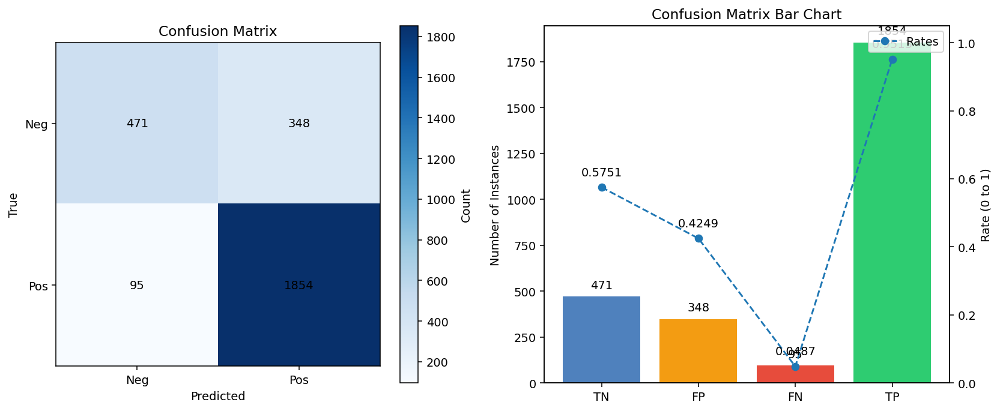
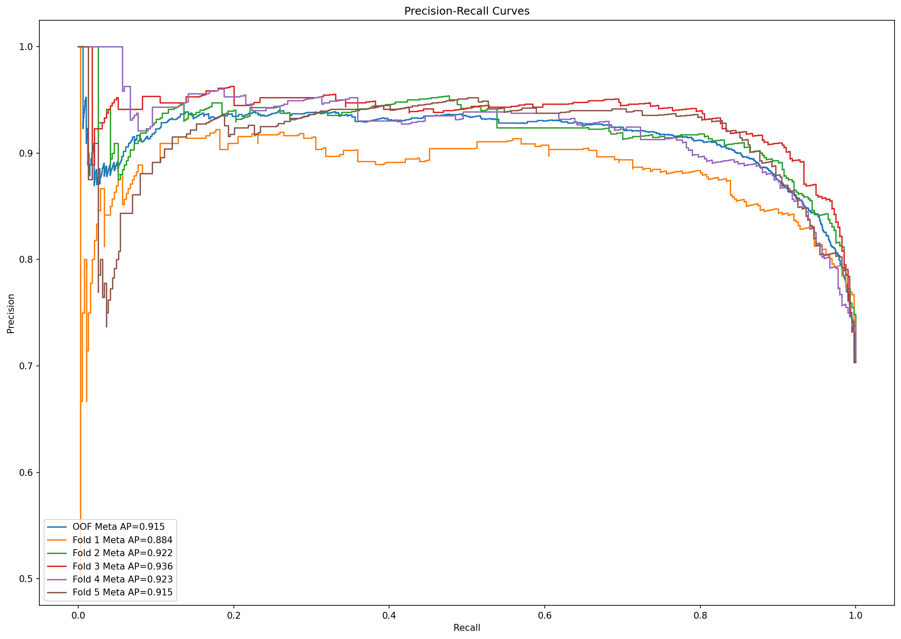
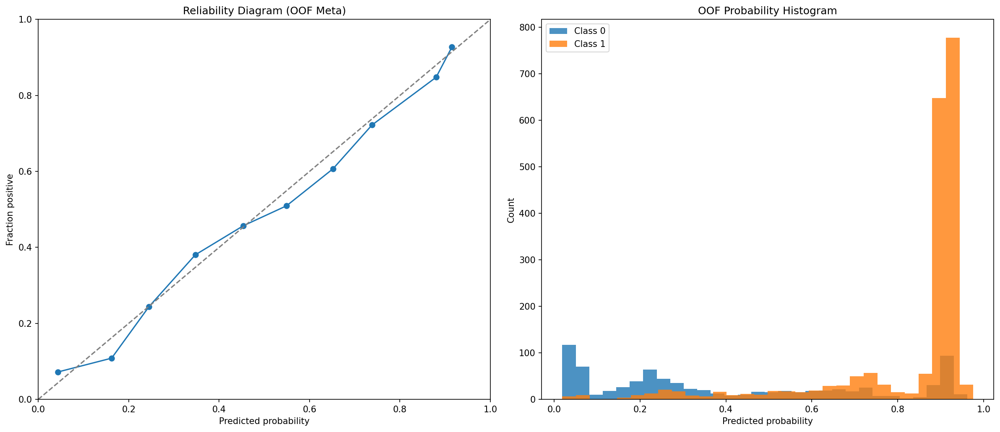
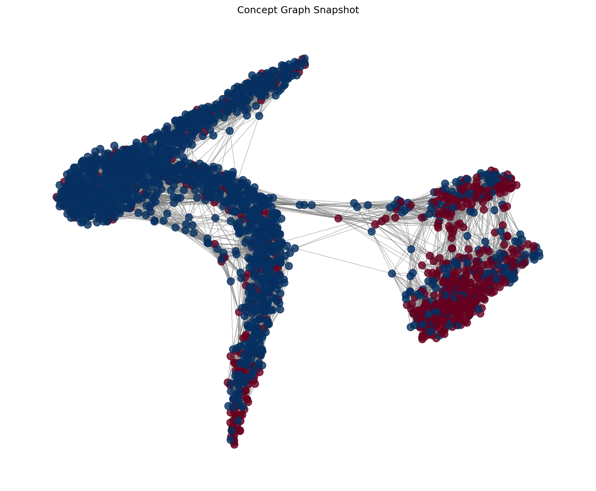

# Quantum-Inspired Stacked Integrated Concept Graph Model (QISICGM) for Diabetes Prediction
Author: Kenneth Young, PhD

## Overview
**QISICGM** is a quantum-inspired machine learning framework that predicts diabetes risk on the PIMA Indians dataset, extended with synthetic data for class balance. The system blends a self-improving concept graph, sequence models, and classical tree/MLP models into a **stacked ensemble** that achieves strong out‑of‑fold (OOF) performance while keeping **CPU inference fast**.

- **Dataset:** 768 PIMA rows + **2,000 synthetic** rows → **2,768** total (positives: **1,949**)
- **OOF Meta Performance (latest run):** **F1 = 0.8933**, **AUC = 0.8699**
- **Thresholds:** max‑F1 threshold = **0.3760**; **balanced** (≤1% F1 drop) = **0.6503**
- **CPU Inference Speed:** 15 patients in **1.755s** (~**8.5 rows/s**) via `make_demo_predictions.py`

## What’s New (v0.2)
- **Faster concept-graph snapshots:** switched to a lightweight NetworkX **spring layout** snapshot (`plot_graph_snapshot`) to avoid long t‑SNE waits; now one PNG per fold (`concept_graph_fold{K}.png`).
- **Consolidated plotting module:** `plots_and_reporting.py` now produces:
  - Confusion matrix + bars (regular and balanced thresholds)
  - Reliability (calibration) + probability histograms
  - ROC & PR curves (OOF + per‑fold)
  - Violin plots of OOF score distributions
  - Fold performance table + summary bars
  - Concept graph snapshots (spring layout)
- **Reproducibility:** consistent seeding and headless‑safe Matplotlib (`Agg` backend) when `DISPLAY` is unset.
- **Cleaner meta features:** calibrated per‑model probabilities + logits + votes + moments (mean/std) → **17‑D** meta vector.

## Why This Matters
Medical screening needs **high recall with precision discipline**. QISICGM’s hybrid stack (trees + transformer + CNN + FFNN) learns complementary views of patients, while the **concept graph** preserves neighborhood structure across training and inference. The result is a **robust, practical, CPU‑friendly** predictor, an approach we believe can improve **AI-assisted clinical triage** and other structured‑data problems beyond diabetes.

## How It’s Quantum‑Inspired
QISICGM adopts efficient **classical analogs** of quantum ideas:
- **Phase Feature Map:** lifts features via `concat[cos(αx), sin(αx)]`, echoing **phase/amplitude encoding** for richer nonlinearity.
- **Self‑Improving Concept Graph:** embeddings refine via gradient steps; an internal k‑NN graph updates to reflect structure, akin to **annealing** toward lower‑energy configurations.
- **Sequence Modeling of Neighborhoods:** neighbor sequences (rank‑ordered) feed a **Transformer** or **CNN‑Seq**, echoing **entanglement-like** interactions across neighbors.
- **Stacked Integration:** a **LogisticRegression meta‑learner** integrates calibrated base model signals, balancing precision/recall via OOF‑selected thresholds.

> “Quantum‑inspired” here means these mechanisms are **implemented on standard CPUs/GPUs** with no quantum hardware, prioritizing **scalability** and **speed**.

## Pipeline at a Glance
1. **Data prep:** impute zeros (selected clinical fields) with medians, then engineer features (`Glucose_BMI`, `G_to_Pressure`, `BMI_sq`) and **scale**.
2. **Embeddings + Graph:** QISICGM produces **128‑D embeddings**, initializes a k‑NN graph, and **self‑improves** embeddings against labels.
3. **Base learners (per fold):**
   - **RF / ET:** trained on embeddings for tree diversity.
   - **Transformer / CNN‑Seq:** trained on **neighbor sequences** derived from the concept graph.
   - **FFNN:** trained on **neighbor‑averaged** embeddings.
4. **Per‑model calibration:** **isotonic** when possible (fallback: Platt), fit on **TRAIN** only; applied to **VAL** and later to **ALL**.
5. **Meta features (17‑D):** calibrated probs (5) + logits (5) + votes≥0.5 (5) + mean (1) + std (1).
6. **Meta learner:** Logistic Regression on OOF meta features → picks **F1‑optimal** threshold (+ a guarded **balanced** threshold).
7. **Final refit:** train everything on **ALL** data; save artifacts under `models/` (including calibrators and scaler).

## Results (OOF)
- **Meta OOF:** **F1 = 0.8933**, **AUC = 0.8699**
- **Balanced threshold:** **0.6503** (≤1% F1 drop), useful when specificity/precision is prioritized.
- **Per‑fold summaries:** see **table** and **summary bars** in `plots/`.

### Demo Inference
```
[make_demo_predictions] Predicted 15 patients in 1.755s (8.5 rows/s)
prob_meta  pred_meta  risk_band
0.5755     1          moderate
0.0000     0          very-low
0.9979     1          very-high
...
Wrote: data/new_patients_scored.csv
```

## Plots
All saved under `plots/`:
- **Confusion Matrices (OOF meta):**
  - 
  - 
- **Performance Table:** 
- **ROC Curves:** 
- **PR Curves:** 
- **Calibration & Histogram:** 
- **Score Distributions:** 
- **Summary Bars:** 
- **Concept Graph (Fold 1 example):** 

## Repository Layout
- **`qisicgm_stacked.py`** — full training & stacking pipeline with OOF metrics, per‑fold plots, and final refit.
- **`plots_and_reporting.py`** — unified plotting utilities (headless‑safe) including `plot_graph_snapshot` (spring layout).
- **`make_demo_predictions.py`** — CPU‑fast scoring for new patients; writes `data/new_patients_scored.csv` with `prob_meta`, `pred_meta`, and `risk_band`.
- **`models/`** — saved artifacts: `qm_final.pth`, base models, `embeddings.npy`, `meta_oof.pkl` (meta model, thresholds, scaler, calibrators).
- **`data/`** — PIMA CSV + optional synthetic CSV; demo input and output files.
- **`requirements.txt`** — Python dependencies.

## Installation
```bash
git clone <https://github.com/keninayoung/QISICGM/>
cd <repo>
python -m venv .venv && source .venv/bin/activate   # (Windows: .venv\Scripts\activate)
pip install -r requirements.txt
```

## Usage
### Train & Plot
```bash
python qisicgm_stacked.py
# Models -> models/, Plots -> plots/
```

### Demo Predictions
```bash
python make_demo_predictions.py --n 15 --show-all
# Output: data/new_patients_scored.csv
```

## Reproducibility
- **Seeding:** NumPy & PyTorch seeded with **42**; scikit‑learn components use `random_state=42`.
- **Headless plotting:** Matplotlib uses **Agg** when `DISPLAY` is absent.
- **Determinism:** Neighbor selection and snapshot seeds are fixed; MC‑dropout uses a small number of passes for stable means.

## Practical Tips
- If concept graph snapshots ever feel slow, keep using **`plot_graph_snapshot`** (spring layout). It’s deterministic with `seed=42` and scales well for quick diagnostics.
- Calibration is done **per fold on TRAIN only** and then applied; if you extend models, keep this separation to avoid leakage.

## License
**MIT** — see `LICENSE`.

## Contributing
1. Fork the repository
2. Create a feature branch: `git checkout -b feature-name`
3. Commit: `git commit -m "feat: add X (short rationale)"`
4. Push: `git push origin feature-name`
5. Open a Pull Request

## Acknowledgments
Thanks to the maintainers of **NumPy**, **PyTorch**, **scikit‑learn**, **NetworkX**, and **Matplotlib**. The “quantum‑inspired” terminology reflects classical approximations of quantum ideas to keep things **practical and fast** on standard hardware.
